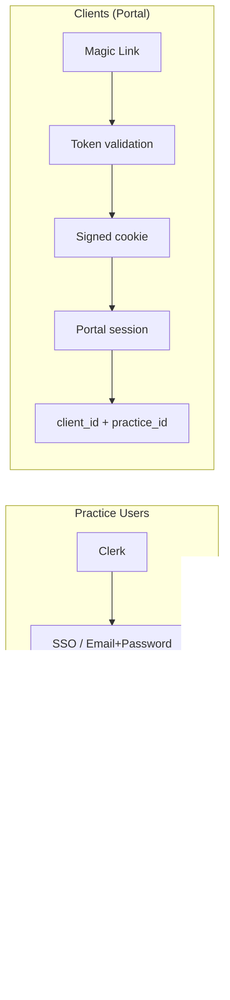

# chase.md — Technical Blueprint

> **Version:** 1.0 | **Date:** 2026-02-15 | **Author:** Austin + Claude
> **Purpose:** Detailed enough to start building tomorrow.

---

## Table of Contents

1. [System Architecture](#1-system-architecture)
2. [Database Schema](#2-database-schema)
3. [WhatsApp Business API Integration](#3-whatsapp-business-api-integration)
4. [Email System](#4-email-system)
5. [Chase Engine Algorithm](#5-chase-engine-algorithm)
6. [Client Portal Architecture](#6-client-portal-architecture)
7. [AI Document Recognition Pipeline](#7-ai-document-recognition-pipeline)
8. [Security Model](#8-security-model)
9. [Infrastructure & Deployment](#9-infrastructure--deployment)
10. [API Design](#10-api-design)

---

## 1. System Architecture

### High-Level Overview


### Tech Stack

| Layer | Technology | Why |
|-------|-----------|-----|
| **Framework** | Next.js 15 (App Router) | SSR, RSC, API routes, Vercel-native |
| **Language** | TypeScript (strict) | End-to-end type safety |
| **API** | tRPC v11 | Type-safe RPC, works beautifully with Next.js |
| **Database** | Neon Postgres (serverless) | Branching for preview deploys, serverless driver |
| **ORM** | Drizzle ORM | SQL-like, lightweight, great migrations |
| **Auth (Practice)** | Clerk | Multi-tenant orgs, webhooks, middleware |
| **Auth (Client)** | Custom magic links | No login friction for clients |
| **File Storage** | Cloudflare R2 | S3-compatible, no egress fees |
| **Queue/Cache** | Upstash Redis + QStash | Serverless queue, cron triggers |
| **Email** | Resend + React Email | Developer-friendly, great deliverability |
| **WhatsApp** | Twilio WhatsApp Business API | Reliable, well-documented, UK support |
| **AI** | Anthropic Claude (Sonnet) | Vision for doc classification, text for tone |
| **Monitoring** | Sentry + PostHog | Errors + product analytics |
| **Deployment** | Vercel | Git push → live. Preview deploys. |
| **UI** | shadcn/ui + Tailwind CSS 4 | Composable, accessible, fast to build |

### Project Structure

```
chase.md/
├── src/
│   ├── app/                          # Next.js App Router
│   │   ├── (dashboard)/              # Practice dashboard (Clerk-protected)
│   │   │   ├── layout.tsx
│   │   │   ├── page.tsx              # Dashboard home
│   │   │   ├── clients/
│   │   │   ├── campaigns/
│   │   │   ├── documents/
│   │   │   └── settings/
│   │   ├── (portal)/                 # Client portal (magic link auth)
│   │   │   ├── p/[token]/            # Magic link entry
│   │   │   └── upload/
│   │   ├── api/
│   │   │   ├── trpc/[trpc]/route.ts
│   │   │   └── webhooks/
│   │   │       ├── twilio/route.ts
│   │   │       ├── resend/route.ts
│   │   │       └── clerk/route.ts
│   │   ├── layout.tsx
│   │   └── page.tsx                  # Marketing site
│   ├── server/
│   │   ├── db/
│   │   │   ├── schema.ts            # Drizzle schema
│   │   │   ├── index.ts             # DB client
│   │   │   └── migrations/
│   │   ├── trpc/
│   │   │   ├── router.ts            # Root router
│   │   │   ├── context.ts
│   │   │   └── routers/
│   │   │       ├── clients.ts
│   │   │       ├── campaigns.ts
│   │   │       ├── documents.ts
│   │   │       └── settings.ts
│   │   └── services/
│   │       ├── chase-engine.ts
│   │       ├── messaging.ts
│   │       ├── document-processor.ts
│   │       ├── ai-classifier.ts
│   │       └── magic-link.ts
│   ├── lib/
│   │   ├── r2.ts                    # R2 client
│   │   ├── redis.ts                 # Upstash client
│   │   ├── twilio.ts                # Twilio client
│   │   ├── resend.ts                # Resend client
│   │   └── anthropic.ts             # Claude client
│   └── components/
│       ├── ui/                      # shadcn components
│       ├── dashboard/
│       └── portal/
├── emails/                          # React Email templates
├── drizzle.config.ts
├── package.json
└── .env.local
```

### Request Flow


---

## 2. Database Schema

### Complete Drizzle ORM Schema

```typescript
// src/server/db/schema.ts
import {
  pgTable,
  uuid,
  text,
  varchar,
  timestamp,
  boolean,
  integer,
  jsonb,
  pgEnum,
  index,
  uniqueIndex,
  decimal,
} from "drizzle-orm/pg-core";
import { relations } from "drizzle-orm";

// ============================================================
// ENUMS
// ============================================================

export const planEnum = pgEnum("plan", ["starter", "professional", "scale"]);
export const userRoleEnum = pgEnum("user_role", ["owner", "admin", "manager", "staff"]);
export const clientTypeEnum = pgEnum("client_type", [
  "sole_trader",
  "limited_company",
  "partnership",
  "llp",
  "trust",
  "individual",
]);
export const taxObligationEnum = pgEnum("tax_obligation", [
  "self_assessment",
  "corporation_tax",
  "vat",
  "paye",
  "mtd_itsa",
  "confirmation_statement",
  "annual_accounts",
]);
export const channelEnum = pgEnum("channel", ["email", "whatsapp", "sms"]);
export const messageStatusEnum = pgEnum("message_status", [
  "pending",
  "queued",
  "sent",
  "delivered",
  "read",
  "failed",
  "opted_out",
]);
export const documentStatusEnum = pgEnum("document_status", [
  "pending",
  "uploaded",
  "processing",
  "classified",
  "accepted",
  "rejected",
  "expired",
]);
export const campaignStatusEnum = pgEnum("campaign_status", [
  "draft",
  "active",
  "paused",
  "completed",
  "cancelled",
]);
export const enrollmentStatusEnum = pgEnum("enrollment_status", [
  "pending",
  "active",
  "completed",
  "opted_out",
  "paused",
]);
export const consentStatusEnum = pgEnum("consent_status", [
  "granted",
  "revoked",
  "expired",
  "never_asked",
]);
export const whatsappTemplateStatusEnum = pgEnum("wa_template_status", [
  "draft",
  "submitted",
  "approved",
  "rejected",
]);
export const auditActionEnum = pgEnum("audit_action", [
  "create",
  "update",
  "delete",
  "send",
  "upload",
  "classify",
  "login",
  "consent_change",
  "export",
  "bulk_action",
]);
export const classificationConfidenceEnum = pgEnum("classification_confidence", [
  "high",    // ≥90%
  "medium",  // 70-89%
  "low",     // 50-69%
  "unknown", // <50%
]);
export const escalationLevelEnum = pgEnum("escalation_level", [
  "gentle",    // First chase
  "reminder",  // Second chase
  "firm",      // Third chase
  "urgent",    // Final chase
  "escalate",  // Hand to accountant
]);

// ============================================================
// TABLES
// ============================================================

// --- PRACTICES ---

export const practices = pgTable("practices", {
  id: uuid("id").primaryKey().defaultRandom(),
  name: varchar("name", { length: 255 }).notNull(),
  slug: varchar("slug", { length: 100 }).notNull().unique(),
  clerkOrgId: varchar("clerk_org_id", { length: 255 }).unique(),
  
  // Contact
  email: varchar("email", { length: 255 }).notNull(),
  phone: varchar("phone", { length: 50 }),
  website: varchar("website", { length: 255 }),
  
  // Address
  addressLine1: varchar("address_line_1", { length: 255 }),
  addressLine2: varchar("address_line_2", { length: 255 }),
  city: varchar("city", { length: 100 }),
  postcode: varchar("postcode", { length: 10 }),
  
  // Branding
  logoUrl: varchar("logo_url", { length: 500 }),
  primaryColor: varchar("primary_color", { length: 7 }).default("#1a1a2e"),
  
  // Billing
  plan: planEnum("plan").default("starter").notNull(),
  stripeCustomerId: varchar("stripe_customer_id", { length: 255 }),
  stripeSubscriptionId: varchar("stripe_subscription_id", { length: 255 }),
  trialEndsAt: timestamp("trial_ends_at", { withTimezone: true }),
  
  // WhatsApp
  twilioAccountSid: varchar("twilio_account_sid", { length: 255 }),
  twilioWhatsappNumber: varchar("twilio_whatsapp_number", { length: 50 }),
  whatsappBusinessId: varchar("whatsapp_business_id", { length: 255 }),
  
  // Email
  resendDomainId: varchar("resend_domain_id", { length: 255 }),
  customEmailDomain: varchar("custom_email_domain", { length: 255 }),
  fromEmailName: varchar("from_email_name", { length: 100 }).default("chase.md"),
  
  // Settings
  defaultChaseChannel: channelEnum("default_chase_channel").default("whatsapp"),
  businessHoursStart: varchar("business_hours_start", { length: 5 }).default("09:00"),
  businessHoursEnd: varchar("business_hours_end", { length: 5 }).default("17:30"),
  businessDays: jsonb("business_days").default([1, 2, 3, 4, 5]), // Mon-Fri
  timezone: varchar("timezone", { length: 50 }).default("Europe/London"),
  
  // Limits (by plan)
  maxClients: integer("max_clients").default(100),
  maxCampaigns: integer("max_campaigns").default(5),
  maxWhatsappPerMonth: integer("max_whatsapp_per_month").default(500),
  
  // Metadata
  createdAt: timestamp("created_at", { withTimezone: true }).defaultNow().notNull(),
  updatedAt: timestamp("updated_at", { withTimezone: true }).defaultNow().notNull(),
  deletedAt: timestamp("deleted_at", { withTimezone: true }),
});

// --- USERS (Practice Staff) ---

export const users = pgTable("users", {
  id: uuid("id").primaryKey().defaultRandom(),
  practiceId: uuid("practice_id").notNull().references(() => practices.id),
  clerkUserId: varchar("clerk_user_id", { length: 255 }).notNull().unique(),
  
  email: varchar("email", { length: 255 }).notNull(),
  firstName: varchar("first_name", { length: 100 }),
  lastName: varchar("last_name", { length: 100 }),
  role: userRoleEnum("role").default("staff").notNull(),
  avatarUrl: varchar("avatar_url", { length: 500 }),
  
  // Notifications
  notifyOnUpload: boolean("notify_on_upload").default(true),
  notifyOnCompletion: boolean("notify_on_completion").default(true),
  notifyDigestFrequency: varchar("notify_digest_frequency", { length: 20 }).default("daily"),
  
  lastLoginAt: timestamp("last_login_at", { withTimezone: true }),
  createdAt: timestamp("created_at", { withTimezone: true }).defaultNow().notNull(),
  updatedAt: timestamp("updated_at", { withTimezone: true }).defaultNow().notNull(),
}, (t) => [
  index("users_practice_id_idx").on(t.practiceId),
]);

// --- CLIENTS ---

export const clients = pgTable("clients", {
  id: uuid("id").primaryKey().defaultRandom(),
  practiceId: uuid("practice_id").notNull().references(() => practices.id),
  
  // Identity
  externalRef: varchar("external_ref", { length: 100 }), // Xero/Sage ID
  firstName: varchar("first_name", { length: 100 }).notNull(),
  lastName: varchar("last_name", { length: 100 }).notNull(),
  companyName: varchar("company_name", { length: 255 }),
  clientType: clientTypeEnum("client_type").notNull(),
  
  // Contact
  email: varchar("email", { length: 255 }),
  phone: varchar("phone", { length: 50 }),         // E.164 format
  whatsappPhone: varchar("whatsapp_phone", { length: 50 }), // E.164, may differ
  preferredChannel: channelEnum("preferred_channel").default("whatsapp"),
  
  // Tax info
  utr: varchar("utr", { length: 10 }),              // Unique Taxpayer Reference
  companyNumber: varchar("company_number", { length: 8 }),
  vatNumber: varchar("vat_number", { length: 12 }),
  taxObligations: jsonb("tax_obligations").default([]), // taxObligationEnum[]
  
  // Year-end / filing dates
  accountingYearEnd: varchar("accounting_year_end", { length: 5 }), // "04-05" or "03-31"
  
  // Chasing preferences
  chaseEnabled: boolean("chase_enabled").default(true),
  notes: text("notes"),
  tags: jsonb("tags").default([]),
  
  // Metadata
  lastChasedAt: timestamp("last_chased_at", { withTimezone: true }),
  createdAt: timestamp("created_at", { withTimezone: true }).defaultNow().notNull(),
  updatedAt: timestamp("updated_at", { withTimezone: true }).defaultNow().notNull(),
  deletedAt: timestamp("deleted_at", { withTimezone: true }),
}, (t) => [
  index("clients_practice_id_idx").on(t.practiceId),
  index("clients_email_idx").on(t.email),
  index("clients_external_ref_idx").on(t.practiceId, t.externalRef),
]);

// --- DOCUMENT TEMPLATES ---

export const documentTemplates = pgTable("document_templates", {
  id: uuid("id").primaryKey().defaultRandom(),
  practiceId: uuid("practice_id").references(() => practices.id), // NULL = system template
  
  name: varchar("name", { length: 255 }).notNull(),       // "P60"
  description: text("description"),                          // "Pay and tax certificate from employer"
  category: varchar("category", { length: 100 }).notNull(), // "employment_income"
  
  // Which client types need this
  applicableClientTypes: jsonb("applicable_client_types").default([]),
  applicableTaxObligations: jsonb("applicable_tax_obligations").default([]),
  
  // AI classification
  aiClassificationHints: jsonb("ai_classification_hints").default([]), // keywords, patterns
  
  // Help content for clients
  helpText: text("help_text"),         // "Your employer gives you this in May/June"
  helpImageUrl: varchar("help_image_url", { length: 500 }),
  exampleImageUrl: varchar("example_image_url", { length: 500 }),
  
  isSystem: boolean("is_system").default(false),
  sortOrder: integer("sort_order").default(0),
  
  createdAt: timestamp("created_at", { withTimezone: true }).defaultNow().notNull(),
  updatedAt: timestamp("updated_at", { withTimezone: true }).defaultNow().notNull(),
}, (t) => [
  index("doc_templates_practice_id_idx").on(t.practiceId),
]);

// --- CLIENT DOCUMENTS ---

export const clientDocuments = pgTable("client_documents", {
  id: uuid("id").primaryKey().defaultRandom(),
  practiceId: uuid("practice_id").notNull().references(() => practices.id),
  clientId: uuid("client_id").notNull().references(() => clients.id),
  templateId: uuid("template_id").references(() => documentTemplates.id),
  campaignId: uuid("campaign_id").references(() => chaseCampaigns.id),
  enrollmentId: uuid("enrollment_id").references(() => chaseEnrollments.id),
  
  // File info
  fileName: varchar("file_name", { length: 500 }),
  fileSize: integer("file_size"),                        // bytes
  mimeType: varchar("mime_type", { length: 100 }),
  r2Key: varchar("r2_key", { length: 500 }),             // R2 object key
  r2Bucket: varchar("r2_bucket", { length: 100 }),
  
  // Status
  status: documentStatusEnum("status").default("pending").notNull(),
  
  // AI classification results
  aiClassification: varchar("ai_classification", { length: 255 }),
  aiConfidence: decimal("ai_confidence", { precision: 5, scale: 4 }),
  aiConfidenceLevel: classificationConfidenceEnum("ai_confidence_level"),
  aiRawResponse: jsonb("ai_raw_response"),
  classifiedAt: timestamp("classified_at", { withTimezone: true }),
  
  // Human review
  manualClassification: varchar("manual_classification", { length: 255 }),
  reviewedBy: uuid("reviewed_by").references(() => users.id),
  reviewedAt: timestamp("reviewed_at", { withTimezone: true }),
  rejectionReason: text("rejection_reason"),
  
  // Tax year / period
  taxYear: varchar("tax_year", { length: 7 }),  // "2025-26"
  periodStart: timestamp("period_start", { withTimezone: true }),
  periodEnd: timestamp("period_end", { withTimezone: true }),
  
  // Virus scan
  virusScanStatus: varchar("virus_scan_status", { length: 20 }).default("pending"),
  virusScannedAt: timestamp("virus_scanned_at", { withTimezone: true }),
  
  // Upload context
  uploadedVia: varchar("uploaded_via", { length: 50 }), // "portal", "whatsapp", "email"
  uploadedByIp: varchar("uploaded_by_ip", { length: 45 }),
  
  createdAt: timestamp("created_at", { withTimezone: true }).defaultNow().notNull(),
  updatedAt: timestamp("updated_at", { withTimezone: true }).defaultNow().notNull(),
}, (t) => [
  index("client_docs_practice_id_idx").on(t.practiceId),
  index("client_docs_client_id_idx").on(t.clientId),
  index("client_docs_campaign_id_idx").on(t.campaignId),
  index("client_docs_status_idx").on(t.status),
]);

// --- CHASE CAMPAIGNS ---

export const chaseCampaigns = pgTable("chase_campaigns", {
  id: uuid("id").primaryKey().defaultRandom(),
  practiceId: uuid("practice_id").notNull().references(() => practices.id),
  createdBy: uuid("created_by").notNull().references(() => users.id),
  
  name: varchar("name", { length: 255 }).notNull(),     // "SA 2025-26 Tax Returns"
  description: text("description"),
  status: campaignStatusEnum("status").default("draft").notNull(),
  
  // What we're chasing
  taxYear: varchar("tax_year", { length: 7 }).notNull(), // "2025-26"
  taxObligation: taxObligationEnum("tax_obligation").notNull(),
  documentTemplateIds: jsonb("document_template_ids").default([]), // UUID[] — which docs to chase
  
  // Scheduling
  startDate: timestamp("start_date", { withTimezone: true }),
  deadlineDate: timestamp("deadline_date", { withTimezone: true }).notNull(), // e.g. 31 Jan 2027
  
  // Chase settings
  maxChases: integer("max_chases").default(6),
  chaseDaysBetween: integer("chase_days_between").default(7), // days between chases
  escalateAfterChase: integer("escalate_after_chase").default(4), // escalate to accountant after N
  channels: jsonb("channels").default(["whatsapp", "email"]), // channelEnum[]
  
  // Grace period: don't chase within N days of deadline (accountant handles)
  gracePeriodDays: integer("grace_period_days").default(14),
  
  // Skip rules
  skipWeekends: boolean("skip_weekends").default(true),
  skipBankHolidays: boolean("skip_bank_holidays").default(true),
  
  // Stats (denormalized for dashboard)
  totalEnrollments: integer("total_enrollments").default(0),
  completedEnrollments: integer("completed_enrollments").default(0),
  
  createdAt: timestamp("created_at", { withTimezone: true }).defaultNow().notNull(),
  updatedAt: timestamp("updated_at", { withTimezone: true }).defaultNow().notNull(),
}, (t) => [
  index("campaigns_practice_id_idx").on(t.practiceId),
  index("campaigns_status_idx").on(t.status),
]);

// --- CHASE ENROLLMENTS (client ↔ campaign) ---

export const chaseEnrollments = pgTable("chase_enrollments", {
  id: uuid("id").primaryKey().defaultRandom(),
  practiceId: uuid("practice_id").notNull().references(() => practices.id),
  campaignId: uuid("campaign_id").notNull().references(() => chaseCampaigns.id),
  clientId: uuid("client_id").notNull().references(() => clients.id),
  
  status: enrollmentStatusEnum("status").default("pending").notNull(),
  
  // Per-client document checklist for this campaign
  requiredDocumentIds: jsonb("required_document_ids").default([]), // documentTemplate UUIDs
  receivedDocumentIds: jsonb("received_document_ids").default([]), // clientDocument UUIDs
  
  // Chase tracking
  currentEscalationLevel: escalationLevelEnum("current_escalation_level").default("gentle"),
  chasesDelivered: integer("chases_delivered").default(0),
  lastChasedAt: timestamp("last_chased_at", { withTimezone: true }),
  nextChaseAt: timestamp("next_chase_at", { withTimezone: true }),
  
  // Completion
  completedAt: timestamp("completed_at", { withTimezone: true }),
  completionPercent: integer("completion_percent").default(0), // 0-100
  
  // Opt-out
  optedOutAt: timestamp("opted_out_at", { withTimezone: true }),
  optOutReason: text("opt_out_reason"),
  
  // Notes
  notes: text("notes"),
  
  createdAt: timestamp("created_at", { withTimezone: true }).defaultNow().notNull(),
  updatedAt: timestamp("updated_at", { withTimezone: true }).defaultNow().notNull(),
}, (t) => [
  index("enrollments_practice_id_idx").on(t.practiceId),
  index("enrollments_campaign_id_idx").on(t.campaignId),
  index("enrollments_client_id_idx").on(t.clientId),
  index("enrollments_next_chase_idx").on(t.nextChaseAt),
  uniqueIndex("enrollments_campaign_client_idx").on(t.campaignId, t.clientId),
]);

// --- CHASE MESSAGES ---

export const chaseMessages = pgTable("chase_messages", {
  id: uuid("id").primaryKey().defaultRandom(),
  practiceId: uuid("practice_id").notNull().references(() => practices.id),
  enrollmentId: uuid("enrollment_id").notNull().references(() => chaseEnrollments.id),
  clientId: uuid("client_id").notNull().references(() => clients.id),
  campaignId: uuid("campaign_id").notNull().references(() => chaseCampaigns.id),
  
  // Message
  channel: channelEnum("channel").notNull(),
  escalationLevel: escalationLevelEnum("escalation_level").notNull(),
  chaseNumber: integer("chase_number").notNull(), // 1, 2, 3...
  
  // Content
  subject: varchar("subject", { length: 255 }),    // email only
  bodyText: text("body_text").notNull(),
  bodyHtml: text("body_html"),                     // email only
  
  // WhatsApp-specific
  whatsappTemplateId: uuid("whatsapp_template_id").references(() => whatsappTemplates.id),
  whatsappTemplateName: varchar("whatsapp_template_name", { length: 255 }),
  whatsappTemplateVars: jsonb("whatsapp_template_vars"),
  
  // Magic link included
  magicLinkId: uuid("magic_link_id").references(() => magicLinks.id),
  
  // Delivery
  status: messageStatusEnum("status").default("pending").notNull(),
  externalMessageId: varchar("external_message_id", { length: 255 }), // Twilio SID / Resend ID
  
  sentAt: timestamp("sent_at", { withTimezone: true }),
  deliveredAt: timestamp("delivered_at", { withTimezone: true }),
  readAt: timestamp("read_at", { withTimezone: true }),
  failedAt: timestamp("failed_at", { withTimezone: true }),
  failureReason: text("failure_reason"),
  
  // Tracking (email)
  emailOpenedAt: timestamp("email_opened_at", { withTimezone: true }),
  emailClickedAt: timestamp("email_clicked_at", { withTimezone: true }),
  
  // Cost
  costPence: integer("cost_pence"), // Cost in pence
  
  scheduledFor: timestamp("scheduled_for", { withTimezone: true }),
  createdAt: timestamp("created_at", { withTimezone: true }).defaultNow().notNull(),
}, (t) => [
  index("messages_practice_id_idx").on(t.practiceId),
  index("messages_enrollment_id_idx").on(t.enrollmentId),
  index("messages_status_idx").on(t.status),
  index("messages_scheduled_idx").on(t.scheduledFor),
]);

// --- MAGIC LINKS ---

export const magicLinks = pgTable("magic_links", {
  id: uuid("id").primaryKey().defaultRandom(),
  practiceId: uuid("practice_id").notNull().references(() => practices.id),
  clientId: uuid("client_id").notNull().references(() => clients.id),
  enrollmentId: uuid("enrollment_id").references(() => chaseEnrollments.id),
  
  token: varchar("token", { length: 64 }).notNull().unique(), // crypto.randomBytes(32).toString('hex')
  
  expiresAt: timestamp("expires_at", { withTimezone: true }).notNull(),
  lastUsedAt: timestamp("last_used_at", { withTimezone: true }),
  usageCount: integer("usage_count").default(0),
  maxUsages: integer("max_usages").default(50), // prevent abuse
  
  // Security
  ipAllowlist: jsonb("ip_allowlist"), // optional IP restriction
  
  isRevoked: boolean("is_revoked").default(false),
  revokedAt: timestamp("revoked_at", { withTimezone: true }),
  
  createdAt: timestamp("created_at", { withTimezone: true }).defaultNow().notNull(),
}, (t) => [
  index("magic_links_token_idx").on(t.token),
  index("magic_links_client_id_idx").on(t.clientId),
]);

// --- CONSENT RECORDS ---

export const consentRecords = pgTable("consent_records", {
  id: uuid("id").primaryKey().defaultRandom(),
  practiceId: uuid("practice_id").notNull().references(() => practices.id),
  clientId: uuid("client_id").notNull().references(() => clients.id),
  
  channel: channelEnum("channel").notNull(),
  status: consentStatusEnum("status").notNull(),
  
  // When / how consent was given
  consentedAt: timestamp("consented_at", { withTimezone: true }),
  consentMethod: varchar("consent_method", { length: 100 }), // "whatsapp_opt_in", "portal_checkbox", "imported"
  consentEvidence: text("consent_evidence"), // screenshot URL, message ID, etc.
  
  // Revocation
  revokedAt: timestamp("revoked_at", { withTimezone: true }),
  revocationMethod: varchar("revocation_method", { length: 100 }), // "stop_keyword", "portal", "manual"
  
  // GDPR
  legalBasis: varchar("legal_basis", { length: 100 }).default("legitimate_interest"),
  privacyNoticeVersion: varchar("privacy_notice_version", { length: 20 }),
  
  createdAt: timestamp("created_at", { withTimezone: true }).defaultNow().notNull(),
  updatedAt: timestamp("updated_at", { withTimezone: true }).defaultNow().notNull(),
}, (t) => [
  index("consent_practice_client_idx").on(t.practiceId, t.clientId),
  index("consent_channel_idx").on(t.channel),
]);

// --- WHATSAPP TEMPLATES ---

export const whatsappTemplates = pgTable("whatsapp_templates", {
  id: uuid("id").primaryKey().defaultRandom(),
  practiceId: uuid("practice_id").references(() => practices.id), // NULL = system template
  
  name: varchar("name", { length: 255 }).notNull(),         // "chase_gentle_v1"
  language: varchar("language", { length: 10 }).default("en_GB"),
  category: varchar("category", { length: 50 }).default("UTILITY"),
  
  // Template content (with {{1}} placeholders)
  headerText: text("header_text"),
  bodyText: text("body_text").notNull(),
  footerText: text("footer_text"),
  
  // Buttons
  buttons: jsonb("buttons").default([]), // [{type: "URL", text: "Upload docs", url: "{{1}}"}]
  
  // Variable mapping
  variables: jsonb("variables").default([]), // ["client_first_name", "practice_name", "portal_url", "deadline"]
  
  // Approval
  status: whatsappTemplateStatusEnum("status").default("draft"),
  twilioTemplateSid: varchar("twilio_template_sid", { length: 255 }),
  submittedAt: timestamp("submitted_at", { withTimezone: true }),
  approvedAt: timestamp("approved_at", { withTimezone: true }),
  rejectedAt: timestamp("rejected_at", { withTimezone: true }),
  rejectionReason: text("rejection_reason"),
  
  // Escalation level this template is for
  escalationLevel: escalationLevelEnum("escalation_level"),
  
  isSystem: boolean("is_system").default(false),
  
  createdAt: timestamp("created_at", { withTimezone: true }).defaultNow().notNull(),
  updatedAt: timestamp("updated_at", { withTimezone: true }).defaultNow().notNull(),
}, (t) => [
  index("wa_templates_practice_id_idx").on(t.practiceId),
]);

// --- AUDIT LOG ---

export const auditLog = pgTable("audit_log", {
  id: uuid("id").primaryKey().defaultRandom(),
  practiceId: uuid("practice_id").notNull().references(() => practices.id),
  
  action: auditActionEnum("action").notNull(),
  entityType: varchar("entity_type", { length: 50 }).notNull(), // "client", "document", "campaign"
  entityId: uuid("entity_id"),
  
  // Who
  userId: uuid("user_id").references(() => users.id),       // Practice user
  clientId: uuid("client_id").references(() => clients.id),  // OR client action
  
  // What changed
  changes: jsonb("changes"),       // { field: { old: x, new: y } }
  metadata: jsonb("metadata"),     // additional context
  
  // Where
  ipAddress: varchar("ip_address", { length: 45 }),
  userAgent: text("user_agent"),
  
  createdAt: timestamp("created_at", { withTimezone: true }).defaultNow().notNull(),
}, (t) => [
  index("audit_practice_id_idx").on(t.practiceId),
  index("audit_entity_idx").on(t.entityType, t.entityId),
  index("audit_created_at_idx").on(t.createdAt),
]);

// ============================================================
// RELATIONS
// ============================================================

export const practicesRelations = relations(practices, ({ many }) => ({
  users: many(users),
  clients: many(clients),
  campaigns: many(chaseCampaigns),
  documentTemplates: many(documentTemplates),
  whatsappTemplates: many(whatsappTemplates),
}));

export const usersRelations = relations(users, ({ one }) => ({
  practice: one(practices, { fields: [users.practiceId], references: [practices.id] }),
}));

export const clientsRelations = relations(clients, ({ one, many }) => ({
  practice: one(practices, { fields: [clients.practiceId], references: [practices.id] }),
  documents: many(clientDocuments),
  enrollments: many(chaseEnrollments),
  consentRecords: many(consentRecords),
  magicLinks: many(magicLinks),
}));

export const campaignsRelations = relations(chaseCampaigns, ({ one, many }) => ({
  practice: one(practices, { fields: [chaseCampaigns.practiceId], references: [practices.id] }),
  createdByUser: one(users, { fields: [chaseCampaigns.createdBy], references: [users.id] }),
  enrollments: many(chaseEnrollments),
  messages: many(chaseMessages),
  documents: many(clientDocuments),
}));

export const enrollmentsRelations = relations(chaseEnrollments, ({ one, many }) => ({
  practice: one(practices, { fields: [chaseEnrollments.practiceId], references: [practices.id] }),
  campaign: one(chaseCampaigns, { fields: [chaseEnrollments.campaignId], references: [chaseCampaigns.id] }),
  client: one(clients, { fields: [chaseEnrollments.clientId], references: [clients.id] }),
  messages: many(chaseMessages),
  documents: many(clientDocuments),
}));

export const messagesRelations = relations(chaseMessages, ({ one }) => ({
  practice: one(practices, { fields: [chaseMessages.practiceId], references: [practices.id] }),
  enrollment: one(chaseEnrollments, { fields: [chaseMessages.enrollmentId], references: [chaseEnrollments.id] }),
  client: one(clients, { fields: [chaseMessages.clientId], references: [clients.id] }),
  campaign: one(chaseCampaigns, { fields: [chaseMessages.campaignId], references: [chaseCampaigns.id] }),
  magicLink: one(magicLinks, { fields: [chaseMessages.magicLinkId], references: [magicLinks.id] }),
  whatsappTemplate: one(whatsappTemplates, { fields: [chaseMessages.whatsappTemplateId], references: [whatsappTemplates.id] }),
}));

export const documentsRelations = relations(clientDocuments, ({ one }) => ({
  practice: one(practices, { fields: [clientDocuments.practiceId], references: [practices.id] }),
  client: one(clients, { fields: [clientDocuments.clientId], references: [clients.id] }),
  template: one(documentTemplates, { fields: [clientDocuments.templateId], references: [documentTemplates.id] }),
  campaign: one(chaseCampaigns, { fields: [clientDocuments.campaignId], references: [chaseCampaigns.id] }),
  enrollment: one(chaseEnrollments, { fields: [clientDocuments.enrollmentId], references: [chaseEnrollments.id] }),
  reviewer: one(users, { fields: [clientDocuments.reviewedBy], references: [users.id] }),
}));
```

### Entity Relationship Diagram


---

## 3. WhatsApp Business API Integration

### Architecture

```mermaid
sequenceDiagram
    participant CE as Chase Engine
    participant MS as Messaging Service
    participant TW as Twilio API
    participant WA as WhatsApp
    participant C as Client
    participant WH as Webhook Handler
    participant DB as Database

    Note over CE,MS: OUTBOUND (Practice → Client)
    CE->>MS: sendChase(enrollment, "gentle")
    MS->>DB: Check consent status
    MS->>DB: Get approved template
    MS->>TW: POST /Messages (template)
    TW->>WA: Deliver template message
    WA->>C: "Hi Sarah, [practice] needs your P60..."
    TW->>WH: Status callback (queued→sent→delivered→read)
    WH->>DB: Update message status

    Note over C,WH: INBOUND (Client → Practice)
    C->>WA: Sends photo of P60
    WA->>TW: Forward media
    TW->>WH: POST /api/webhooks/twilio
    WH->>DB: Create client_document
    WH->>MS: Process media → R2 → classify
    
    Note over C,WH: OPT-OUT
    C->>WA: "STOP"
    WA->>TW: Forward
    TW->>WH: Inbound message
    WH->>DB: Revoke consent, pause enrollment
    WH->>TW: Send "You've been unsubscribed" confirmation
```



### Twilio Setup

```typescript
// src/lib/twilio.ts
import Twilio from "twilio";

const client = Twilio(
  process.env.TWILIO_ACCOUNT_SID,
  process.env.TWILIO_AUTH_TOKEN
);

export async function sendWhatsAppTemplate(params: {
  to: string;              // E.164: "+447700900000"
  from: string;            // "whatsapp:+14155238886" (Twilio sandbox or BSP number)
  templateName: string;    // "chase_gentle_v1"  
  templateVars: Record<string, string>;  // {{1}}, {{2}}, etc.
  statusCallback: string;  // Our webhook URL
}) {
  return client.messages.create({
    to: `whatsapp:${params.to}`,
    from: params.from,
    contentSid: params.templateName, // Twilio Content Template SID
    contentVariables: JSON.stringify(params.templateVars),
    statusCallback: params.statusCallback,
  });
}
```

### Template Messages (Pre-Approved)

WhatsApp requires template pre-approval for business-initiated messages. We need these templates approved:

| Template Name | Escalation | Body |
|--------------|------------|------|
| `chase_gentle_v1` | gentle | "Hi {{1}}, {{2}} here. We're preparing your {{3}} and need a few documents from you. Tap below to see what's needed and upload — takes 2 minutes! 📎" |
| `chase_reminder_v1` | reminder | "Hi {{1}}, just a friendly reminder from {{2}} — we still need {{3}} document(s) for your {{4}}. The deadline is {{5}}. Tap below to upload 👇" |
| `chase_firm_v1` | firm | "Hi {{1}}, {{2}} here. We're still waiting on {{3}} document(s) for your {{4}}. The deadline is {{5}} and we need these soon to file on time. Please upload today:" |
| `chase_urgent_v1` | urgent | "⚠️ Hi {{1}}, {{2}} needs your {{3}} document(s) urgently. The filing deadline is {{4}} — just {{5}} days away. Without these, we can't file on time. Please upload now:" |
| `doc_received_v1` | — | "✅ Thanks {{1}}! We've received your {{2}}. {{3}} more document(s) to go. Upload the rest here:" |
| `all_complete_v1` | — | "🎉 All done, {{1}}! We've received everything we need for your {{2}}. {{3}} will take it from here. Nothing more needed from you!" |

### Consent Management

```typescript
// Consent flow:
// 1. Practice imports clients → consent status = "never_asked"
// 2. Practice sends initial opt-in request (manual, NOT via chase engine)
// 3. Client replies "YES" or clicks opt-in link → consent = "granted"
// 4. Chase engine only sends to clients with consent = "granted"
// 5. Client sends "STOP" at any time → consent = "revoked"
// 6. All consent changes logged to consent_records + audit_log

const STOP_KEYWORDS = ["stop", "unsubscribe", "cancel", "quit", "end", "optout", "opt-out"];

async function handleInboundWhatsApp(message: TwilioInbound) {
  const body = message.Body?.toLowerCase().trim();
  
  if (STOP_KEYWORDS.includes(body)) {
    await revokeConsent(message.From, "whatsapp", "stop_keyword");
    await pauseAllEnrollments(message.From);
    await sendOptOutConfirmation(message.From);
    return;
  }
  
  // Check for media (document upload via WhatsApp)
  if (message.NumMedia > 0) {
    await processWhatsAppMedia(message);
    return;
  }
  
  // Free-text reply — log and optionally notify practice
  await logInboundMessage(message);
}
```

### Cost Model

| Item | Cost |
|------|------|
| WhatsApp Business-initiated (template) | ~£0.035/message (UK utility) |
| WhatsApp User-initiated (within 24h window) | ~£0.015/conversation |
| Twilio WhatsApp per message | $0.005 markup |
| **Average chase cost (4 messages)** | **~£0.16/client/campaign** |
| **1000 clients × 4 chases** | **~£160/campaign** |

At £149/month plan, WhatsApp costs are ~10% of revenue. Excellent margins.

---

## 4. Email System

### Resend Integration

```typescript
// src/lib/resend.ts
import { Resend } from "resend";

const resend = new Resend(process.env.RESEND_API_KEY);

export async function sendChaseEmail(params: {
  to: string;
  from: string;          // "chase@youraccount.chase.md" or custom domain
  subject: string;
  react: React.ReactElement; // React Email component
  practiceId: string;
  messageId: string;
}) {
  const { data, error } = await resend.emails.send({
    from: params.from,
    to: params.to,
    subject: params.subject,
    react: params.react,
    headers: {
      "X-Chase-Practice-Id": params.practiceId,
      "X-Chase-Message-Id": params.messageId,
    },
    tags: [
      { name: "practice_id", value: params.practiceId },
      { name: "message_id", value: params.messageId },
    ],
  });

  return { resendId: data?.id, error };
}
```

### React Email Templates

```tsx
// emails/chase-gentle.tsx
import { Body, Container, Head, Html, Preview, Section, Text, Button, Img, Hr } from "@react-email/components";

interface ChaseGentleProps {
  clientFirstName: string;
  practiceName: string;
  practiceLogo?: string;
  practiceColor: string;
  documentsNeeded: string[];
  portalUrl: string;
  deadline: string;
  taxYear: string;
}

export function ChaseGentleEmail(props: ChaseGentleProps) {
  return (
    <Html>
      <Head />
      <Preview>
        {props.practiceName} needs {props.documentsNeeded.length} document(s) from you
      </Preview>
      <Body style={{ fontFamily: "sans-serif", backgroundColor: "#f6f6f6" }}>
        <Container style={{ maxWidth: 600, margin: "0 auto", backgroundColor: "#fff" }}>
          {props.practiceLogo && (
            
          )}
          <Section style={{ padding: "20px 30px" }}>
            <Text>Hi {props.clientFirstName},</Text>
            <Text>
              We're preparing your {props.taxYear} tax return and need a few
              documents from you. Here's what we need:
            </Text>
            <ul>
              {props.documentsNeeded.map((doc) => (
                <li key={doc}>{doc}</li>
              ))}
            </ul>
            <Button
              href={props.portalUrl}
              style={{
                backgroundColor: props.practiceColor,
                color: "#fff",
                padding: "12px 24px",
                borderRadius: 6,
                textDecoration: "none",
                display: "inline-block",
              }}
            >
              Upload Documents
            </Button>
            <Text style={{ fontSize: 14, color: "#666" }}>
              Deadline: {props.deadline}
            </Text>
          </Section>
          <Hr />
          <Section style={{ padding: "10px 30px" }}>
            <Text style={{ fontSize: 12, color: "#999" }}>
              Sent by {props.practiceName} via chase.md
            </Text>
          </Section>
        </Container>
      </Body>
    </Html>
  );
}
```

### Email Tracking

```typescript
// Webhook: POST /api/webhooks/resend
export async function POST(req: Request) {
  const event = await req.json();
  // Verify webhook signature
  
  switch (event.type) {
    case "email.delivered":
      await db.update(chaseMessages)
        .set({ status: "delivered", deliveredAt: new Date() })
        .where(eq(chaseMessages.externalMessageId, event.data.email_id));
      break;
    case "email.opened":
      await db.update(chaseMessages)
        .set({ emailOpenedAt: new Date() })
        .where(eq(chaseMessages.externalMessageId, event.data.email_id));
      break;
    case "email.clicked":
      await db.update(chaseMessages)
        .set({ emailClickedAt: new Date() })
        .where(eq(chaseMessages.externalMessageId, event.data.email_id));
      break;
    case "email.bounced":
      await db.update(chaseMessages)
        .set({ status: "failed", failedAt: new Date(), failureReason: "bounced" })
        .where(eq(chaseMessages.externalMessageId, event.data.email_id));
      break;
  }
}
```

### Custom Domain Support

Each practice can verify their own domain for sending:

1. Practice enters domain in settings (e.g., `smith-accounts.co.uk`)
2. We call `resend.domains.create({ name: "smith-accounts.co.uk" })`
3. Resend returns DNS records (SPF, DKIM, DMARC)
4. Practice adds DNS records (we show instructions)
5. We poll `resend.domains.verify()` until verified
6. Emails now send from `chase@smith-accounts.co.uk`

**Default:** Practices without custom domains send from `{practice-slug}@notifications.chase.md`

---

## 5. Chase Engine Algorithm

### Core Loop

The chase engine is the heart of the product. It runs on a cron schedule (QStash) and determines: **who gets chased, when, via what channel, with what content.**

```mermaid
flowchart TD
    START[Cron fires every 15 min] --> QUERY[Query enrollments where<br/>next_chase_at ≤ NOW<br/>AND status = 'active']
    QUERY --> BATCH{Any due?}
    BATCH -->|No| DONE[Exit]
    BATCH -->|Yes| LOOP[For each enrollment]
    
    LOOP --> CHECK_COMPLETE{All docs<br/>received?}
    CHECK_COMPLETE -->|Yes| COMPLETE[Mark complete<br/>Send celebration msg]
    
    CHECK_COMPLETE -->|No| CHECK_GRACE{Within grace<br/>period?}
    CHECK_GRACE -->|Yes| ESCALATE_PRACTICE[Notify practice:<br/>"Client X hasn't responded<br/>Deadline in N days"]
    
    CHECK_GRACE -->|No| CHECK_MAX{Max chases<br/>reached?}
    CHECK_MAX -->|Yes| ESCALATE_PRACTICE
    
    CHECK_MAX -->|No| CHECK_HOURS{Within business<br/>hours?}
    CHECK_HOURS -->|No| DEFER[Reschedule to<br/>next business hour]
    
    CHECK_HOURS -->|Yes| CHECK_CONSENT{Has consent<br/>for channel?}
    CHECK_CONSENT -->|No| TRY_ALT[Try alternate channel]
    TRY_ALT --> CHECK_CONSENT2{Has consent<br/>for alt channel?}
    CHECK_CONSENT2 -->|No| SKIP[Skip, flag for<br/>manual action]
    CHECK_CONSENT2 -->|Yes| SELECT_CHANNEL
    
    CHECK_CONSENT -->|Yes| SELECT_CHANNEL[Select channel]
    SELECT_CHANNEL --> COMPOSE[Compose message<br/>Select template<br/>Set escalation tone]
    COMPOSE --> GENERATE_LINK[Generate magic link<br/>for portal]
    GENERATE_LINK --> SEND[Send via<br/>Twilio/Resend]
    SEND --> UPDATE[Update enrollment:<br/>chases_delivered++<br/>next_chase_at += interval<br/>escalation_level++]
    UPDATE --> AUDIT[Write audit log]
    AUDIT --> LOOP
```

### Pseudocode

```typescript
// src/server/services/chase-engine.ts

export async function processChaseQueue() {
  const now = new Date();
  
  // Get all due enrollments across all practices
  const dueEnrollments = await db.query.chaseEnrollments.findMany({
    where: and(
      eq(chaseEnrollments.status, "active"),
      lte(chaseEnrollments.nextChaseAt, now),
    ),
    with: {
      client: true,
      campaign: true,
      practice: true,
    },
    limit: 100, // Process in batches
  });

  for (const enrollment of dueEnrollments) {
    try {
      await processEnrollment(enrollment);
    } catch (err) {
      console.error(`Chase failed for enrollment ${enrollment.id}`, err);
      await logError(enrollment, err);
    }
  }
}

async function processEnrollment(enrollment: EnrollmentWithRelations) {
  const { client, campaign, practice } = enrollment;
  
  // 1. Check if already complete
  const receivedCount = enrollment.receivedDocumentIds.length;
  const requiredCount = enrollment.requiredDocumentIds.length;
  
  if (receivedCount >= requiredCount) {
    await markComplete(enrollment);
    await sendCompletionMessage(enrollment);
    return;
  }

  // 2. Check grace period
  const daysToDeadline = differenceInDays(campaign.deadlineDate, new Date());
  if (daysToDeadline <= campaign.gracePeriodDays) {
    await escalateToPractice(enrollment, "grace_period");
    await db.update(chaseEnrollments)
      .set({ status: "paused", notes: "Grace period — escalated to practice" })
      .where(eq(chaseEnrollments.id, enrollment.id));
    return;
  }

  // 3. Check max chases
  if (enrollment.chasesDelivered >= campaign.maxChases) {
    await escalateToPractice(enrollment, "max_chases_reached");
    await db.update(chaseEnrollments)
      .set({ status: "paused", notes: "Max chases reached — escalated" })
      .where(eq(chaseEnrollments.id, enrollment.id));
    return;
  }

  // 4. Check business hours
  if (!isWithinBusinessHours(practice)) {
    const nextSlot = getNextBusinessHourSlot(practice);
    await db.update(chaseEnrollments)
      .set({ nextChaseAt: nextSlot })
      .where(eq(chaseEnrollments.id, enrollment.id));
    return;
  }

  // 5. Determine channel
  const channel = await selectChannel(client, campaign, enrollment);
  if (!channel) {
    await flagForManualAction(enrollment, "no_consented_channel");
    return;
  }

  // 6. Determine escalation level
  const escalation = getEscalationLevel(enrollment.chasesDelivered, campaign.maxChases);

  // 7. Compose and send
  const magicLink = await createMagicLink(client, enrollment);
  const message = await composeMessage(enrollment, channel, escalation, magicLink);
  await sendMessage(message);

  // 8. Update enrollment
  const nextChaseAt = addDays(new Date(), campaign.chaseDaysBetween);
  await db.update(chaseEnrollments).set({
    chasesDelivered: enrollment.chasesDelivered + 1,
    lastChasedAt: new Date(),
    nextChaseAt: skipWeekendsAndHolidays(nextChaseAt, campaign),
    currentEscalationLevel: escalation,
  }).where(eq(chaseEnrollments.id, enrollment.id));

  // 9. Audit
  await createAuditEntry({
    practiceId: practice.id,
    action: "send",
    entityType: "chase_message",
    entityId: message.id,
    metadata: { channel, escalation, chaseNumber: enrollment.chasesDelivered + 1 },
  });
}

function getEscalationLevel(chasesDelivered: number, maxChases: number): EscalationLevel {
  const ratio = chasesDelivered / maxChases;
  if (ratio < 0.25) return "gentle";
  if (ratio < 0.5) return "reminder";
  if (ratio < 0.75) return "firm";
  return "urgent";
}

async function selectChannel(
  client: Client,
  campaign: Campaign,
  enrollment: Enrollment
): Promise<Channel | null> {
  const channels = campaign.channels as Channel[];
  
  // Prefer client's preferred channel
  if (channels.includes(client.preferredChannel)) {
    const hasConsent = await checkConsent(client.id, client.preferredChannel);
    if (hasConsent) return client.preferredChannel;
  }
  
  // Alternate: try WhatsApp first (higher engagement), then email
  const priority: Channel[] = ["whatsapp", "email"];
  for (const ch of priority) {
    if (!channels.includes(ch)) continue;
    const hasConsent = await checkConsent(client.id, ch);
    if (hasConsent) return ch;
  }
  
  // Alternate channels based on previous chase results
  // If last WhatsApp was undelivered, try email this time
  const lastMessage = await getLastMessage(enrollment.id);
  if (lastMessage?.channel === "whatsapp" && lastMessage.status === "failed") {
    const hasEmailConsent = await checkConsent(client.id, "email");
    if (hasEmailConsent) return "email";
  }
  
  return null;
}
```

### Scheduling & Skip Logic

```typescript
function skipWeekendsAndHolidays(date: Date, campaign: Campaign): Date {
  let result = date;
  const practice = campaign.practice;
  const businessDays = practice.businessDays as number[]; // [1,2,3,4,5] = Mon-Fri
  
  // Skip non-business days
  while (!businessDays.includes(getDay(result))) {
    result = addDays(result, 1);
  }
  
  // Skip UK bank holidays
  if (campaign.skipBankHolidays && isUKBankHoliday(result)) {
    result = addDays(result, 1);
    return skipWeekendsAndHolidays(result, campaign); // Recurse
  }
  
  // Set to a good time (10am-2pm, randomized to avoid thundering herd)
  const hour = 10 + Math.floor(Math.random() * 4);
  const minute = Math.floor(Math.random() * 60);
  result = setHours(setMinutes(result, minute), hour);
  
  return result;
}
```

---

## 6. Client Portal Architecture

### Magic Link Auth Flow


### Portal Session Management

```typescript
// No traditional auth — magic link sets a signed, httpOnly cookie

interface PortalSession {
  clientId: string;
  practiceId: string;
  enrollmentId: string;
  magicLinkId: string;
  expiresAt: number; // Unix timestamp
}

// Cookie: `chase_portal_session` = signed JWT (jose library)
// Expires: same as magic link (30 days default)
// HttpOnly, Secure, SameSite=Lax
```

### Upload Pipeline

```mermaid
flowchart LR
    A[Client selects file<br/>or takes photo] --> B[Client-side validation<br/>Max 25MB, allowed types]
    B --> C[Generate presigned<br/>R2 upload URL]
    C --> D[Direct upload<br/>Client → R2]
    D --> E[Create client_document<br/>status: 'uploaded']
    E --> F[Trigger classification<br/>via QStash]
    F --> G[Claude Vision<br/>classifies document]
    G --> H{Confidence ≥ 90%?}
    H -->|Yes| I[Auto-accept<br/>status: 'classified']
    H -->|No| J{Confidence ≥ 70%?}
    J -->|Yes| K[Accept with flag<br/>for review]
    J -->|No| L[Queue for<br/>manual review]
    I --> M[Update enrollment<br/>progress]
    K --> M
    L --> N[Notify practice:<br/>"Document needs review"]
    M --> O[Real-time update<br/>to portal UI]
    O --> P{All docs<br/>received?}
    P -->|Yes| Q[🎉 Completion screen<br/>+ celebrate message]
    P -->|No| R[Update progress bar<br/>show remaining docs]
```

### Upload Implementation

```typescript
// src/server/services/document-processor.ts

export async function generateUploadUrl(params: {
  practiceId: string;
  clientId: string;
  enrollmentId: string;
  fileName: string;
  mimeType: string;
  fileSize: number;
}) {
  // Validate
  const MAX_SIZE = 25 * 1024 * 1024; // 25MB
  const ALLOWED_TYPES = [
    "image/jpeg", "image/png", "image/heic", "image/webp",
    "application/pdf",
    "application/vnd.ms-excel",
    "application/vnd.openxmlformats-officedocument.spreadsheetml.sheet",
  ];
  
  if (params.fileSize > MAX_SIZE) throw new Error("File too large");
  if (!ALLOWED_TYPES.includes(params.mimeType)) throw new Error("File type not allowed");

  const key = `${params.practiceId}/${params.clientId}/${params.enrollmentId}/${crypto.randomUUID()}/${params.fileName}`;
  
  const url = await r2.createPresignedUpload({
    bucket: "chase-documents",
    key,
    contentType: params.mimeType,
    maxContentLength: MAX_SIZE,
    expiresIn: 3600, // 1 hour
  });

  // Create document record
  const doc = await db.insert(clientDocuments).values({
    practiceId: params.practiceId,
    clientId: params.clientId,
    enrollmentId: params.enrollmentId,
    fileName: params.fileName,
    fileSize: params.fileSize,
    mimeType: params.mimeType,
    r2Key: key,
    r2Bucket: "chase-documents",
    status: "pending",
    uploadedVia: "portal",
  }).returning();

  return { uploadUrl: url, documentId: doc[0].id };
}
```

### Real-Time Progress

Use **Server-Sent Events (SSE)** for portal updates (simpler than WebSocket, works everywhere):

```typescript
// src/app/api/portal/events/route.ts
export async function GET(req: Request) {
  const session = await getPortalSession(req);
  if (!session) return new Response("Unauthorized", { status: 401 });

  const encoder = new TextEncoder();
  const stream = new ReadableStream({
    async start(controller) {
      // Poll DB every 2 seconds for changes
      const interval = setInterval(async () => {
        const enrollment = await db.query.chaseEnrollments.findFirst({
          where: eq(chaseEnrollments.id, session.enrollmentId),
        });
        
        controller.enqueue(
          encoder.encode(`data: ${JSON.stringify({
            completionPercent: enrollment.completionPercent,
            receivedCount: enrollment.receivedDocumentIds.length,
            requiredCount: enrollment.requiredDocumentIds.length,
          })}\n\n`)
        );
      }, 2000);

      req.signal.addEventListener("abort", () => clearInterval(interval));
    },
  });

  return new Response(stream, {
    headers: {
      "Content-Type": "text/event-stream",
      "Cache-Control": "no-cache",
      Connection: "keep-alive",
    },
  });
}
```

### Mobile-First Portal UI

The portal must be **mobile-first** because most clients will open it from WhatsApp on their phone:

- **Camera capture**: `<input type="file" accept="image/*" capture="environment">` — lets clients photograph documents directly
- **Progress bar**: visual checklist with ✅ / ⬜ states
- **Drag-and-drop** on desktop, tap-to-upload on mobile
- **Instant feedback**: show thumbnail + classification result within seconds
- **Practice branding**: logo + primary color from practice settings
- **Help tooltips**: "What does a P60 look like?" with example images from document_templates
- **No scroll fatigue**: one document at a time, swipe/next pattern on mobile

---

## 7. AI Document Recognition Pipeline

### Classification Flow

```typescript
// src/server/services/ai-classifier.ts
import Anthropic from "@anthropic-ai/sdk";

const anthropic = new Anthropic();

interface ClassificationResult {
  documentType: string;       // "P60", "Bank Statement", etc.
  confidence: number;         // 0.0 - 1.0
  confidenceLevel: "high" | "medium" | "low" | "unknown";
  taxYear?: string;           // "2025-26" if detectable
  extractedFields?: Record<string, string>; // employer name, NI number, etc.
  reasoning: string;          // Why it classified this way
}

export async function classifyDocument(params: {
  r2Key: string;
  mimeType: string;
  expectedDocuments: string[]; // What the enrollment expects
  practiceId: string;
}): Promise<ClassificationResult> {
  // 1. Get file from R2
  const file = await r2.get("chase-documents", params.r2Key);
  const base64 = Buffer.from(await file.arrayBuffer()).toString("base64");

  // 2. For PDFs, convert first page to image (or use pdf-to-image)
  const mediaType = params.mimeType.startsWith("image/")
    ? params.mimeType
    : "image/png"; // Convert PDF first page

  // 3. Call Claude Vision
  const response = await anthropic.messages.create({
    model: "claude-sonnet-4-20250514",
    max_tokens: 1024,
    messages: [
      {
        role: "user",
        content: [
          {
            type: "image",
            source: {
              type: "base64",
              media_type: mediaType,
              data: base64,
            },
          },
          {
            type: "text",
            text: `You are a UK tax document classifier for an accountancy practice.

Classify this document. The client was asked to provide one of these:
${params.expectedDocuments.map((d, i) => `${i + 1}. ${d}`).join("\n")}

Respond in JSON:
{
  "documentType": "The document type (from the list above, or 'Unknown' if unclear)",
  "confidence": 0.95,
  "taxYear": "2025-26 or null",
  "extractedFields": {"employer": "...", "ni_number": "...", etc},
  "reasoning": "Brief explanation"
}

If the image is blurry, upside-down, or not a recognisable document, set confidence below 0.5.
If it's a recognisable UK tax document but not in the expected list, still classify it and note this.`,
          },
        ],
      },
    ],
  });

  const text = response.content[0].type === "text" ? response.content[0].text : "";
  const parsed = JSON.parse(text);

  return {
    ...parsed,
    confidenceLevel:
      parsed.confidence >= 0.9 ? "high" :
      parsed.confidence >= 0.7 ? "medium" :
      parsed.confidence >= 0.5 ? "low" : "unknown",
  };
}
```

### Confidence Thresholds & Actions

| Confidence | Level | Action |
|-----------|-------|--------|
| ≥ 90% | High | Auto-accept, mark document received, update progress |
| 70-89% | Medium | Accept but flag for practice review |
| 50-69% | Low | Queue for manual classification by practice |
| < 50% | Unknown | Reject, ask client to re-upload with guidance |

### Cost Estimates

| Model | Input (per image) | Output | Cost per classification |
|-------|-------------------|--------|------------------------|
| Claude Sonnet 4 | ~1500 tokens (image) + 200 (prompt) | ~300 tokens | **~$0.006 (~£0.005)** |
| **1000 clients × 5 docs** | | | **~£25** |

Negligible cost. Use Sonnet, not Haiku — accuracy matters more here.

### Fallback Flow

```
1. Client uploads document
2. Claude Vision classifies → confidence 45% ("Unknown")
3. Portal shows: "We couldn't identify this document automatically."
4. Portal asks: "What type of document is this?" → dropdown of expected docs
5. Client selects "P60" manually
6. Document saved with manual_classification = "P60"
7. Practice gets notification: "Document manually classified — please verify"
```

---

## 8. Security Model

### Multi-Tenancy

**Row Level Security (RLS)** via Neon Postgres:

```sql
-- Enable RLS on all tables
ALTER TABLE clients ENABLE ROW LEVEL SECURITY;
ALTER TABLE client_documents ENABLE ROW LEVEL SECURITY;
ALTER TABLE chase_campaigns ENABLE ROW LEVEL SECURITY;
-- ... all tables with practice_id

-- Policy: users can only see their practice's data
CREATE POLICY practice_isolation ON clients
  USING (practice_id = current_setting('app.current_practice_id')::uuid);

-- Set per-request
SET app.current_practice_id = '...';
```

**Application-level enforcement** (defense in depth):

```typescript
// src/server/trpc/context.ts
export async function createContext({ req }: { req: Request }) {
  const auth = await currentUser(); // Clerk
  if (!auth) return { practiceId: null, userId: null };

  const user = await db.query.users.findFirst({
    where: eq(users.clerkUserId, auth.id),
  });

  // Set RLS context
  await db.execute(sql`SET app.current_practice_id = ${user.practiceId}`);

  return { practiceId: user.practiceId, userId: user.id, role: user.role };
}

// Every tRPC procedure automatically scoped
export const protectedProcedure = t.procedure.use(async ({ ctx, next }) => {
  if (!ctx.practiceId) throw new TRPCError({ code: "UNAUTHORIZED" });
  return next({ ctx });
});
```

### Auth Flows



### Encryption

| Data | At Rest | In Transit |
|------|---------|------------|
| Documents (R2) | AES-256 (R2 default) | TLS 1.3 |
| Database | AES-256 (Neon default) | TLS 1.3 |
| UTR / NI numbers | Application-level AES-256-GCM | TLS 1.3 |
| Magic link tokens | Hashed (SHA-256) in DB | TLS 1.3 |
| API keys / secrets | Vercel encrypted env vars | TLS 1.3 |

```typescript
// Sensitive field encryption
import { createCipheriv, createDecipheriv, randomBytes } from "crypto";

const ENCRYPTION_KEY = Buffer.from(process.env.FIELD_ENCRYPTION_KEY!, "hex"); // 32 bytes

export function encryptField(plaintext: string): string {
  const iv = randomBytes(16);
  const cipher = createCipheriv("aes-256-gcm", ENCRYPTION_KEY, iv);
  const encrypted = Buffer.concat([cipher.update(plaintext, "utf8"), cipher.final()]);
  const tag = cipher.getAuthTag();
  return `${iv.toString("hex")}:${tag.toString("hex")}:${encrypted.toString("hex")}`;
}

export function decryptField(ciphertext: string): string {
  const [ivHex, tagHex, encHex] = ciphertext.split(":");
  const decipher = createDecipheriv("aes-256-gcm", ENCRYPTION_KEY, Buffer.from(ivHex, "hex"));
  decipher.setAuthTag(Buffer.from(tagHex, "hex"));
  return decipher.update(Buffer.from(encHex, "hex")) + decipher.final("utf8");
}
```

### GDPR Compliance Architecture

| Requirement | Implementation |
|-------------|---------------|
| **Lawful basis** | Legitimate interest (practice-client relationship) + explicit consent for WhatsApp |
| **Right to access** | Export endpoint: `GET /api/gdpr/export?clientId=X` → JSON + zip of docs |
| **Right to erasure** | Delete endpoint: cascade delete client + docs + messages + R2 objects |
| **Right to rectification** | Standard CRUD on client records |
| **Data minimisation** | Only collect what's needed for document chasing |
| **Retention** | Auto-delete documents after configurable period (default: 7 years for tax docs) |
| **Consent records** | Full audit trail in consent_records table |
| **Data Processing Agreement** | chase.md as data processor; practice as controller |
| **Breach notification** | Sentry alerting → manual process within 72h |

### Audit Logging

Every significant action logged:

```typescript
export async function audit(params: {
  practiceId: string;
  action: AuditAction;
  entityType: string;
  entityId?: string;
  userId?: string;
  clientId?: string;
  changes?: Record<string, { old: any; new: any }>;
  metadata?: Record<string, any>;
  req?: Request;
}) {
  await db.insert(auditLog).values({
    practiceId: params.practiceId,
    action: params.action,
    entityType: params.entityType,
    entityId: params.entityId,
    userId: params.userId,
    clientId: params.clientId,
    changes: params.changes,
    metadata: params.metadata,
    ipAddress: params.req?.headers.get("x-forwarded-for"),
    userAgent: params.req?.headers.get("user-agent"),
  });
}
```

---

## 9. Infrastructure & Deployment

### Vercel Deployment


### Environment Variables

```bash
# Database
DATABASE_URL=                    # Neon connection string (pooled)
DATABASE_URL_DIRECT=             # Neon direct connection (migrations)

# Auth
CLERK_SECRET_KEY=
NEXT_PUBLIC_CLERK_PUBLISHABLE_KEY=
CLERK_WEBHOOK_SECRET=

# Messaging
TWILIO_ACCOUNT_SID=
TWILIO_AUTH_TOKEN=
TWILIO_WHATSAPP_NUMBER=
RESEND_API_KEY=
RESEND_WEBHOOK_SECRET=

# Storage
R2_ACCOUNT_ID=
R2_ACCESS_KEY_ID=
R2_SECRET_ACCESS_KEY=
R2_BUCKET_NAME=chase-documents

# AI
ANTHROPIC_API_KEY=

# Cache / Queue
UPSTASH_REDIS_REST_URL=
UPSTASH_REDIS_REST_TOKEN=
QSTASH_TOKEN=
QSTASH_CURRENT_SIGNING_KEY=
QSTASH_NEXT_SIGNING_KEY=

# Security
FIELD_ENCRYPTION_KEY=            # 32-byte hex for PII encryption
MAGIC_LINK_SECRET=               # JWT signing key for portal sessions

# Monitoring
SENTRY_DSN=
NEXT_PUBLIC_SENTRY_DSN=
NEXT_PUBLIC_POSTHOG_KEY=
NEXT_PUBLIC_POSTHOG_HOST=

# Payments
STRIPE_SECRET_KEY=
STRIPE_WEBHOOK_SECRET=
NEXT_PUBLIC_STRIPE_PUBLISHABLE_KEY=
```

### CI/CD Pipeline

```yaml
# .github/workflows/ci.yml
name: CI
on:
  push:
    branches: [main]
  pull_request:

jobs:
  check:
    runs-on: ubuntu-latest
    steps:
      - uses: actions/checkout@v4
      - uses: pnpm/action-setup@v4
      - uses: actions/setup-node@v4
        with: { node-version: 22, cache: pnpm }
      - run: pnpm install --frozen-lockfile
      - run: pnpm typecheck        # tsc --noEmit
      - run: pnpm lint              # eslint + biome
      - run: pnpm test              # vitest
      - run: pnpm db:generate       # Drizzle migration check

  e2e:
    runs-on: ubuntu-latest
    needs: check
    steps:
      - uses: actions/checkout@v4
      - uses: pnpm/action-setup@v4
      - uses: actions/setup-node@v4
        with: { node-version: 22, cache: pnpm }
      - run: pnpm install --frozen-lockfile
      - run: npx playwright install --with-deps
      - run: pnpm test:e2e
```

### Monitoring

| Tool | Purpose | Cost |
|------|---------|------|
| **Sentry** | Error tracking, performance monitoring | Free tier (5K events/mo) |
| **PostHog** | Product analytics, feature flags, session replay | Free tier (1M events/mo) |
| **Vercel Analytics** | Web vitals, real user monitoring | Included |
| **Neon Dashboard** | DB metrics, query performance | Included |
| **Upstash Dashboard** | Redis + QStash metrics | Included |
| **BetterStack** | Uptime monitoring, status page | Free tier |

### Cost Projections

| Item | 10 Practices | 100 Practices | 1000 Practices |
|------|-------------|---------------|-----------------|
| **Revenue (MRR)** | £1,490 | £14,900 | £149,000 |
| **Vercel** | Free/Pro ($20) | Pro ($20) | Enterprise (~$500) |
| **Neon Postgres** | Free | Scale ($69) | Scale ($300) |
| **Cloudflare R2** | Free (<10GB) | ~$5 | ~$50 |
| **Upstash Redis** | Free | Pro ($10) | Pro ($30) |
| **QStash** | Free | Pro ($25) | Pro ($100) |
| **Clerk** | Free (<10K MAU) | Pro ($25) | Pro ($100) |
| **Resend** | Free (<3K/mo) | Pro ($20) | Scale ($100) |
| **Twilio WhatsApp** | ~£50 | ~£500 | ~£5,000 |
| **Claude API** | ~£5 | ~£50 | ~£500 |
| **Sentry** | Free | Team ($26) | Business ($80) |
| **PostHog** | Free | Free | Scale ($450) |
| **Domain + misc** | £20 | £20 | £50 |
| **Total infra** | **~£95** | **~£770** | **~£7,260** |
| **Gross margin** | **93.6%** | **94.8%** | **95.1%** |

---

## 10. API Design

### tRPC Router Structure

```typescript
// src/server/trpc/router.ts
import { router } from "./trpc";
import { clientsRouter } from "./routers/clients";
import { campaignsRouter } from "./routers/campaigns";
import { documentsRouter } from "./routers/documents";
import { settingsRouter } from "./routers/settings";
import { dashboardRouter } from "./routers/dashboard";
import { portalRouter } from "./routers/portal";

export const appRouter = router({
  clients: clientsRouter,
  campaigns: campaignsRouter,
  documents: documentsRouter,
  settings: settingsRouter,
  dashboard: dashboardRouter,
  portal: portalRouter,     // Public — magic link auth
});

export type AppRouter = typeof appRouter;
```

### Key Procedures

#### Clients

```typescript
// src/server/trpc/routers/clients.ts
export const clientsRouter = router({
  list: protectedProcedure
    .input(z.object({
      search: z.string().optional(),
      clientType: z.enum(["sole_trader", "limited_company", ...]).optional(),
      chaseEnabled: z.boolean().optional(),
      page: z.number().default(1),
      perPage: z.number().default(25),
    }))
    .query(async ({ ctx, input }) => {
      // Returns: { clients: Client[], total: number, page: number }
    }),

  get: protectedProcedure
    .input(z.object({ id: z.string().uuid() }))
    .query(async ({ ctx, input }) => {
      // Returns: Client with enrollments, documents, consent records
    }),

  create: protectedProcedure
    .input(z.object({
      firstName: z.string().min(1),
      lastName: z.string().min(1),
      email: z.string().email().optional(),
      phone: z.string().optional(),
      clientType: z.enum(["sole_trader", "limited_company", ...]),
      taxObligations: z.array(z.string()),
      // ... all client fields
    }))
    .mutation(async ({ ctx, input }) => {
      // Returns: Client
    }),

  update: protectedProcedure
    .input(z.object({ id: z.string().uuid(), ...partialClientFields }))
    .mutation(async ({ ctx, input }) => {}),

  delete: protectedProcedure
    .input(z.object({ id: z.string().uuid() }))
    .mutation(async ({ ctx, input }) => {
      // Soft delete
    }),

  import: protectedProcedure
    .input(z.object({
      clients: z.array(clientSchema),
      source: z.enum(["csv", "xero", "sage"]),
    }))
    .mutation(async ({ ctx, input }) => {
      // Bulk import, returns: { created: number, skipped: number, errors: string[] }
    }),

  exportGdpr: protectedProcedure
    .input(z.object({ id: z.string().uuid() }))
    .mutation(async ({ ctx, input }) => {
      // Returns: download URL for GDPR data export
    }),

  deleteGdpr: protectedProcedure
    .input(z.object({ id: z.string().uuid(), confirm: z.literal(true) }))
    .mutation(async ({ ctx, input }) => {
      // Hard delete all data including R2 objects
    }),
});
```

#### Campaigns

```typescript
export const campaignsRouter = router({
  list: protectedProcedure
    .input(z.object({
      status: campaignStatusSchema.optional(),
      taxYear: z.string().optional(),
    }))
    .query(async ({ ctx, input }) => {
      // Returns: Campaign[] with stats
    }),

  get: protectedProcedure
    .input(z.object({ id: z.string().uuid() }))
    .query(async ({ ctx, input }) => {
      // Returns: Campaign with enrollments, messages, stats
    }),

  create: protectedProcedure
    .input(z.object({
      name: z.string(),
      taxYear: z.string(),
      taxObligation: z.string(),
      documentTemplateIds: z.array(z.string().uuid()),
      deadlineDate: z.string().datetime(),
      clientIds: z.array(z.string().uuid()), // Clients to enroll
      channels: z.array(z.enum(["email", "whatsapp"])),
      maxChases: z.number().min(1).max(20).default(6),
      chaseDaysBetween: z.number().min(1).max(30).default(7),
      startDate: z.string().datetime().optional(),
    }))
    .mutation(async ({ ctx, input }) => {
      // Creates campaign + enrollments for all selected clients
      // Calculates initial nextChaseAt for each enrollment
      // Returns: Campaign with enrollment count
    }),

  activate: protectedProcedure
    .input(z.object({ id: z.string().uuid() }))
    .mutation(async ({ ctx, input }) => {
      // Sets status = 'active', schedules first chase batch
    }),

  pause: protectedProcedure
    .input(z.object({ id: z.string().uuid() }))
    .mutation(async ({ ctx, input }) => {}),

  stats: protectedProcedure
    .input(z.object({ id: z.string().uuid() }))
    .query(async ({ ctx, input }) => {
      // Returns: { total, completed, inProgress, optedOut, escalated, responseRate, avgDaysToComplete }
    }),
});
```

#### Documents

```typescript
export const documentsRouter = router({
  list: protectedProcedure
    .input(z.object({
      clientId: z.string().uuid().optional(),
      campaignId: z.string().uuid().optional(),
      status: documentStatusSchema.optional(),
      needsReview: z.boolean().optional(),
    }))
    .query(async ({ ctx, input }) => {}),

  getDownloadUrl: protectedProcedure
    .input(z.object({ id: z.string().uuid() }))
    .query(async ({ ctx, input }) => {
      // Returns: presigned R2 download URL (expires in 1h)
    }),

  classify: protectedProcedure
    .input(z.object({
      id: z.string().uuid(),
      classification: z.string(),
    }))
    .mutation(async ({ ctx, input }) => {
      // Manual classification by practice user
    }),

  accept: protectedProcedure
    .input(z.object({ id: z.string().uuid() }))
    .mutation(async ({ ctx, input }) => {
      // Accept document, update enrollment progress
    }),

  reject: protectedProcedure
    .input(z.object({
      id: z.string().uuid(),
      reason: z.string(),
    }))
    .mutation(async ({ ctx, input }) => {
      // Reject, notify client to re-upload
    }),
});
```

#### Dashboard

```typescript
export const dashboardRouter = router({
  overview: protectedProcedure.query(async ({ ctx }) => {
    // Returns:
    // {
    //   activeCampaigns: number,
    //   totalClients: number,
    //   documentsReceived: number,
    //   documentsOutstanding: number,
    //   completionRate: number,        // percentage
    //   messagesThisMonth: number,
    //   recentActivity: Activity[],    // last 20 events
    //   upcomingDeadlines: Deadline[], // next 5 deadlines
    // }
  }),

  clientsNeedingAttention: protectedProcedure.query(async ({ ctx }) => {
    // Returns clients who: haven't responded after N chases, opted out, or have review-needed docs
  }),
});
```

#### Portal (Public — Client-Facing)

```typescript
export const portalRouter = router({
  // Auth via magic link token (not Clerk)
  validate: publicProcedure
    .input(z.object({ token: z.string() }))
    .mutation(async ({ input }) => {
      // Validates magic link, returns session cookie
      // Returns: { valid: boolean, clientName: string, practiceName: string, enrollmentId: string }
    }),

  getChecklist: portalProcedure  // Requires portal session
    .query(async ({ ctx }) => {
      // Returns: {
      //   practiceName, practiceLogo, practiceColor,
      //   documents: [{ id, name, description, helpText, exampleImage, status, uploadedFile? }],
      //   completionPercent,
      //   deadline,
      // }
    }),

  getUploadUrl: portalProcedure
    .input(z.object({
      templateId: z.string().uuid(),
      fileName: z.string(),
      mimeType: z.string(),
      fileSize: z.number(),
    }))
    .mutation(async ({ ctx, input }) => {
      // Returns: { uploadUrl: string, documentId: string }
    }),

  confirmUpload: portalProcedure
    .input(z.object({ documentId: z.string().uuid() }))
    .mutation(async ({ ctx, input }) => {
      // Triggers classification pipeline
      // Returns: { status: "processing" }
    }),
});
```

### Webhook Endpoints (REST)

```typescript
// POST /api/webhooks/twilio       — WhatsApp status callbacks + inbound messages
// POST /api/webhooks/resend       — Email delivery/open/click events
// POST /api/webhooks/clerk        — User/org lifecycle events
// POST /api/webhooks/stripe       — Subscription lifecycle events
// POST /api/cron/chase-engine     — QStash cron trigger (every 15 min)
// POST /api/cron/daily-digest     — QStash cron (daily 8am)
```

---

## Appendix A: MVP Scope (8-Week Build)

### Week 1-2: Foundation
- [ ] Next.js 15 project setup with tRPC, Drizzle, Tailwind, shadcn
- [ ] Neon database + schema migration
- [ ] Clerk auth integration
- [ ] Basic practice settings page

### Week 3-4: Core Data
- [ ] Client CRUD (manual entry + CSV import)
- [ ] Document template library (seed with SA/MTD defaults)
- [ ] Campaign creation wizard
- [ ] Dashboard overview

### Week 5-6: Chase Engine + Messaging
- [ ] Chase engine core loop
- [ ] Email integration (Resend + React Email templates)
- [ ] WhatsApp integration (Twilio — start with sandbox)
- [ ] Magic link generation
- [ ] Message status tracking

### Week 7: Client Portal
- [ ] Magic link auth
- [ ] Upload portal (R2 presigned URLs)
- [ ] AI classification (Claude Vision)
- [ ] Real-time progress (SSE)
- [ ] Practice branding

### Week 8: Polish + Launch
- [ ] Consent management
- [ ] Audit logging
- [ ] Error handling + Sentry
- [ ] PostHog analytics
- [ ] Landing page
- [ ] Beta launch to stepdad's practice

### Post-MVP
- Xero integration (client sync)
- Stripe billing
- Practice custom email domains
- WhatsApp Business API production approval
- Bulk operations
- Reporting / analytics dashboard
- Mobile app (React Native / PWA)

---

## Appendix B: Key Decisions Log

| Decision | Choice | Rationale |
|----------|--------|-----------|
| API style | tRPC | End-to-end type safety, excellent DX with Next.js |
| ORM | Drizzle | Lighter than Prisma, SQL-like, great migrations |
| Auth (practice) | Clerk | Multi-tenant orgs, webhooks, middleware — don't build auth |
| Auth (client) | Magic links | Zero friction, no password, no app download |
| WhatsApp provider | Twilio | Most reliable BSP, good UK support, well-documented |
| Email provider | Resend | Developer-first, React Email, great deliverability |
| File storage | Cloudflare R2 | S3-compatible, zero egress fees, cheap |
| Queue | QStash + Upstash | Serverless-native, works with Vercel, no infrastructure |
| AI model | Claude Sonnet | Best vision accuracy for documents, reasonable cost |
| Database | Neon Postgres | Serverless, branching for previews, great free tier |
| Deployment | Vercel | Best Next.js host, preview deploys, edge functions |
| UI | shadcn/ui | Composable, accessible, copy-paste ownership |
| Real-time | SSE | Simpler than WebSocket, works on Vercel, sufficient for our use case |

---

*This blueprint is a living document. Update it as decisions evolve.*
